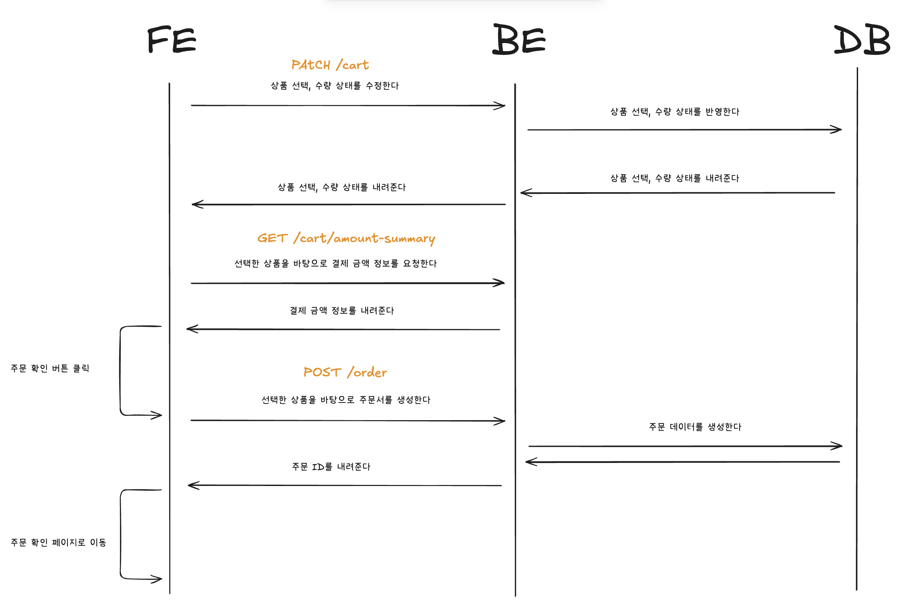
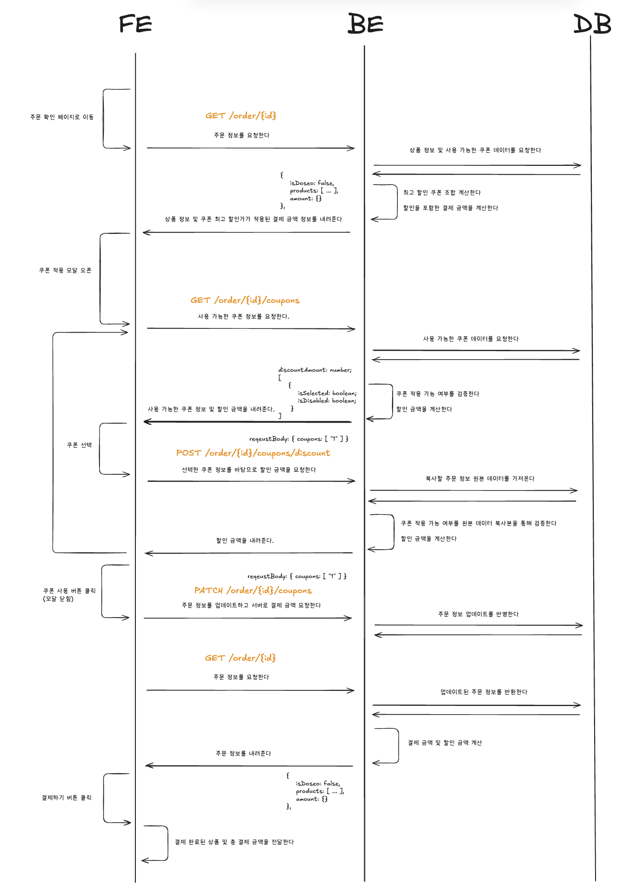
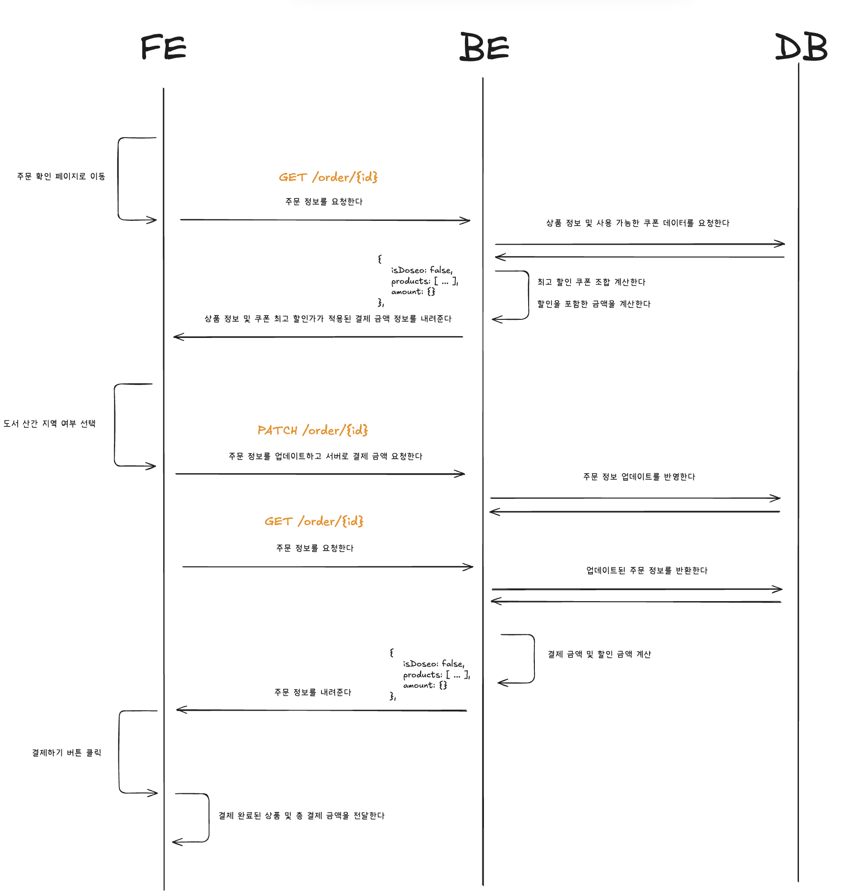

# 시스템 설계 (System Design)

장바구니 → 주문 확인 → 결제까지의 흐름을 **FE / BE / DB** 3개 레인의 시퀀스 다이어그램으로 정리한 문서입니다.
API 상세 스펙은 [API 명세서](../server/docs/api.md)를 참고해주세요.

---

## 0. 핵심 설계 원칙

본격적인 플로우에 앞서, 전체 설계에서 일관되게 적용한 의사결정과 그 근거를 먼저 정리합니다.

### 1) 계산 로직은 모두 백엔드(SSOT)에 위임한다

상태를 **클라이언트에서 관리할 것**과 **서버에서 관리할 것**으로 명확히 나눴습니다.

| 구분                   | 관리 주체              | 대상                                                   |
| ---------------------- | ---------------------- | ------------------------------------------------------ |
| 입력값(원천 데이터)    | 클라이언트 → 서버 전달 | 상품 선택 여부, 수량, 선택한 쿠폰, 도서 산간 지역 여부 |
| 계산 결과(파생 데이터) | **서버 (SSOT)**        | 주문 금액, 쿠폰 할인 금액, 배송비, 총 결제 금액        |

- **근거**: 결제 금액·할인 금액·배송비는 비즈니스 규칙(무료 배송 정책, 쿠폰 적용 조건, 최적 할인 조합 등)에 의존하는 **파생 데이터**입니다. 이를 클라이언트가 직접 계산하면 규칙이 양쪽에 중복되고, 정합성이 깨질 위험이 있습니다.
- 따라서 클라이언트는 **원천 데이터만 서버로 전달**하고, 화면에 표시할 모든 금액은 **서버 응답을 그대로 신뢰(SSOT)** 하도록 설계했습니다.
- 결론적으로 **프론트엔드는 도메인 규칙(쿠폰 적용 조건·할인 계산 등)을 알지 않습니다.** 쿠폰을 선택할 때마다 서버에 계산을 요청하고, 클라이언트는 그 결과만 렌더링합니다.

### 2) 쿠폰 사용 가능 여부 판단도 서버 책임이다

- 쿠폰의 사용 가능 여부(`isDisabled`)와 최적 할인 조합은 **현재 주문의 금액·시간대 등 주문 컨텍스트에 의존**합니다.
- 그래서 쿠폰 조회 API를 `order`의 하위 리소스(`GET /orders/{id}/coupons`)로 두고, 클라이언트는 응답으로 내려온 `isSelected` / `isDisabled` 값만 보고 UI를 렌더링합니다.
- 또한 **쿠폰의 할인 방식(정책)은 백엔드 코드가 아니라 DB에 데이터로 정의**합니다. 정책이 바뀌어도 코드 배포 없이 데이터로 대응할 수 있도록 하기 위함입니다.

### 3) 주문 생성 시점에 order 레코드를 DB에 저장한다

- **근거**:
  - 주문 수량을 **상품 재고와 비교/검증**하려면 서버에 주문 상태가 존재해야 합니다.
  - 주문이 최종 완료되면 어차피 order 정보는 영속화되어야 합니다.
  - 주문 ID를 기준으로 이후의 쿠폰 적용·배송지 변경·금액 재계산을 일관되게 다룰 수 있습니다.
- 즉, **주문 확인 단계에서 미리 주문서(order)를 생성**하고, 이후 단계는 모두 이 주문 ID를 기준으로 동작합니다.
- 대안으로 **router state나 URL query parameter로 상품 id·수량을 넘기는 방식**도 검토했지만(이 경우 DB 저장 불필요), 새로고침·직접 진입에 취약하고 매 요청마다 주문 정보를 다시 실어 보내야 했습니다. 그래서 라우터로는 **아무 데이터도 넘기지 않고**, 주문 확인 페이지는 주문 ID로 서버에서 정보를 다시 조회합니다.

---

## 1. 장바구니 플로우 — 상품 선택부터 주문서 생성까지

장바구니 페이지에서 상품을 선택/수정하고, 주문 확인 버튼으로 주문서를 생성하는 흐름입니다.

**흐름 설명**

1. **상품 선택 / 수량 변경** — 사용자가 상품의 선택 여부나 수량을 바꾸면, FE는 `PATCH /carts/{id}`로 변경된 상태를 서버에 반영하고, 서버는 갱신된 장바구니 상태를 내려줍니다.
2. **결제 금액 재조회** — 선택 상태가 바뀔 때마다 FE는 `GET /carts/payment`를 호출해 **선택된 상품 기준의 주문 금액·배송비·총 결제 금액을 서버로부터 받아** 화면에 반영합니다. (금액은 클라이언트가 계산하지 않습니다.)
3. **주문 확인 버튼 클릭** — 1개 이상 상품이 선택된 상태에서 버튼을 누르면, FE는 `POST /orders`로 선택한 상품 목록을 전달해 **주문서를 생성**합니다.
4. 서버는 주문 레코드를 DB에 저장하고 **주문 ID를 반환**하며, FE는 해당 ID로 **주문 확인 페이지로 이동**합니다.

> 💡 이 단계에서 order 레코드를 미리 만들어 두기 때문에, 이후 쿠폰/배송지 변경이 모두 동일한 주문 ID 위에서 이뤄집니다. (설계 원칙 3번)

---

## 2. 쿠폰 적용 플로우 — 주문 확인 페이지

주문 확인 페이지에 진입한 뒤, 쿠폰 모달을 열어 쿠폰을 선택하고 할인 금액을 적용하는 흐름입니다.

**흐름 설명**

1. **주문 정보 조회** — 페이지 진입 시 FE는 `GET /orders/{id}`로 주문 상품 목록과 현재 결제 금액 정보를 받아 화면을 구성합니다.
2. **쿠폰 적용 모달 오픈** — 쿠폰 적용 버튼을 누르면 FE는 `GET /orders/{id}/coupons`로 **사용 가능한 쿠폰 목록**을 요청합니다. 서버는 각 쿠폰의 적용 가능 여부를 검증해 `isSelected` / `isDisabled` 와 함께 내려주고, 첫 진입 시 **할인율이 가장 큰 조합**을 기본 선택해 줍니다.
3. **쿠폰 선택 → 예상 할인 금액 계산** — 사용자가 쿠폰을 선택하면, FE는 `POST /orders/{id}/coupons/discount`(`{ coupons: [...] }`)로 **선택한 쿠폰 기준의 할인 금액**을 요청합니다.
   - 이때 서버는 **원본 주문 데이터를 직접 변경하지 않고**, 복사본(draft)을 기준으로 적용 가능 여부를 검증하고 할인 금액만 계산해 돌려줍니다. → 모달 안에서의 "미리보기"가 실제 주문 상태를 오염시키지 않도록 분리한 설계입니다.
4. **쿠폰 사용 버튼 클릭(모달 닫힘)** — 최종 선택을 확정하면 FE는 `PATCH /orders/{id}/coupons`로 적용할 쿠폰을 주문에 반영합니다.
5. 반영 후 FE는 다시 `GET /orders/{id}`로 **할인이 적용된 최신 결제 금액**을 받아 화면을 갱신합니다.

> 💡 "예상 할인 미리보기(draft 기반 계산)"와 "실제 쿠폰 적용(PATCH)"을 분리한 것이 이 플로우의 핵심입니다.

---

## 3. 도서 산간 지역 선택 & 결제 플로우

배송지(도서 산간 지역) 여부를 반영해 최종 금액을 확정하고 결제를 완료하는 흐름입니다.

**흐름 설명**

1. **도서 산간 지역 여부 선택** — 사용자가 제주/도서 산간 지역을 체크하면, FE는 `PATCH /orders/{id}`(`{ isRemoteArea: true }`)로 주문 정보를 업데이트합니다.
2. 서버는 변경된 배송지 정보를 반영해 **배송비를 포함한 결제 금액·할인 금액을 다시 계산**합니다.
3. **결제 금액 재조회** — FE는 `GET /orders/{id}`로 업데이트된 결제 금액 정보를 받아 화면에 반영합니다.
4. **결제하기 버튼 클릭** — 최종 확정된 주문 상품과 총 결제 금액을 결제 확인 페이지로 전달하며, 결제 완료 시 주문한 상품은 장바구니에서 비워집니다.

> 💡 배송지 변경 역시 금액 계산을 서버에 위임하는 동일한 패턴(상태 변경 → 서버 재계산 → 재조회)을 따릅니다. (설계 원칙 1번)

---

## 부록: 사용 API 요약

| 단계      | API                                  | 설명                              |
| --------- | ------------------------------------ | --------------------------------- |
| 장바구니  | `PATCH /carts/{id}`                  | 상품 선택 여부 / 수량 변경        |
| 장바구니  | `GET /carts/payment`                 | 선택 상품 기준 결제 금액 조회     |
| 장바구니  | `POST /orders`                       | 선택 상품으로 주문서 생성         |
| 주문 확인 | `GET /orders/{id}`                   | 주문 정보 및 결제 금액 조회       |
| 쿠폰      | `GET /orders/{id}/coupons`           | 사용 가능한 쿠폰 목록 조회        |
| 쿠폰      | `POST /orders/{id}/coupons/discount` | 선택 쿠폰 기준 할인 금액 미리보기 |
| 쿠폰      | `PATCH /orders/{id}/coupons`         | 주문에 쿠폰 적용                  |
| 배송지    | `PATCH /orders/{id}`                 | 도서 산간 지역 여부 업데이트      |

> 각 API의 요청/응답 스키마는 [API 명세서](../server/docs/api.md)를 참고하세요.
